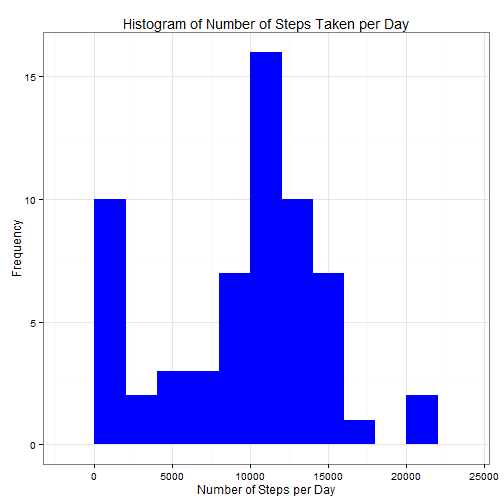
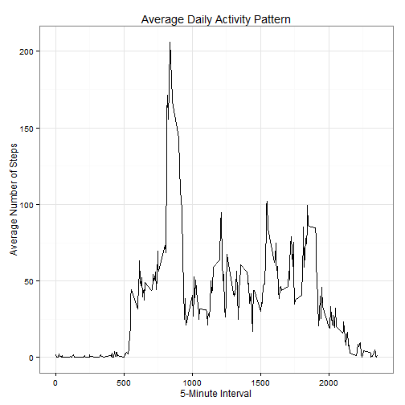
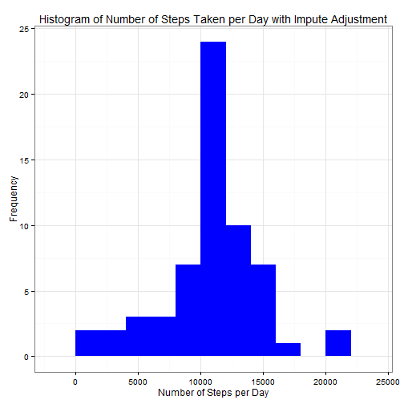
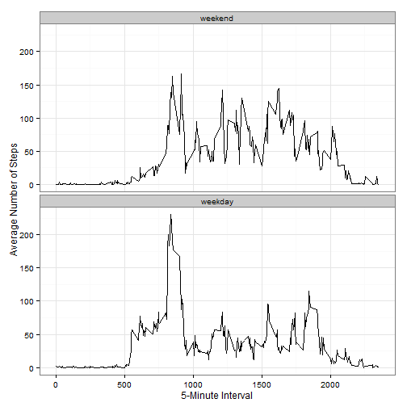

  
** This document contains completed Peer Assignment 1 **  

## Introduction    
This document presents the results of the Reproducible Research's Peer Assessment 1 in a report using a R markdown document is processed by knitr and transformed into an HTML file.

Each section that follows below performs the following:  
1. Loading and preprocessing the data  
2. What is mean total number of steps taken per day?  
3. What is the average daily activity pattern?  
4. Imputing missing values  
5. Are there differences in activity patterns between weekdays and weekends?  
  
  
## Loading and preprocessing the data  
Load the required knitr package and set global knitr options for generating literate program

```r
require(knitr)
opts_chunk$set(echo = TRUE, results = 'hold')
```
    
Load the required library to process and plot the data

```r
require(plyr)
require(ggplot2)
```
  
Read the activity data file located in the R working directory

```r
data<-read.csv("activity.csv", sep=",",header = TRUE, na.strings = "NA",
  colClasses = c("numeric","character","numeric"))
data$date <- as.Date(data$date, format="%Y-%m-%d")
head(data)
```

```
##   steps       date interval
## 1    NA 2012-10-01        0
## 2    NA 2012-10-01        5
## 3    NA 2012-10-01       10
## 4    NA 2012-10-01       15
## 5    NA 2012-10-01       20
## 6    NA 2012-10-01       25
```
  
   
## What is mean total number of steps taken per day?  
** For this part of the assignment, you can ignore the missing values in the dataset. **
  
1. Calculate aggregate total steps per day  

```r
steps_day <- ddply(data, .(date), function(x) c(steps=sum(x$steps,na.rm=TRUE)))
```
  
2. Plot a histogram of the total number of steps taken each day, bin of 2000  

```r
with(steps_day,{ggplot(steps_day, aes(x = steps)) +
      geom_histogram(fill="blue",binwidth=2000) +
      labs(title="Histogram of Number of Steps Taken per Day", 
      x = "Number of Steps per Day",
      y = "Frequency") +
      theme_bw()
  })
```

 
  
3. Calculate and report the mean and median of the total number of steps taken per day  

```r
mean_steps = mean(steps_day$steps, na.rm=TRUE)
median_steps = median(steps_day$steps, na.rm=TRUE)
```
The mean total number of the steps taken per day is 9354.2295  
The median total number of steps taken per day is 10395  
  
    
## What is the average daily activity pattern?  
1. Make a time series plot (i.e. type = "l") of the 5-minute interval (x-axis) and the average number of steps taken, averaged across all days (y-axis)  
  
The average number of steps taken averaged across all days  

```r
steps_interval <- ddply(data, .(interval), function(x) c(steps=mean(x$steps,na.rm=TRUE)))
```
Plot a line graph of 5-minute interval average number of steps and the avereage number of steps taken, average across all days

```r
with(steps_interval,{
  ggplot(steps_interval, aes(x=interval, y=steps)) +   
      geom_line() +  
      labs(title="Average Daily Activity Pattern", x="5-Minute Interval", y="Average Number of Steps") +
      theme_bw()
    })
```

 
  
2. Which 5-minute interval, on average across all the days in the dataset, contains the maximum number of steps?  

```r
steps_max_interval <- steps_interval[which.max(steps_interval$steps),]$interval
```
The 5-minute interval that contains the maximum number of steps on average across all the days in the dataset is 835
  
    
## Imputing missing values  

1. Calculate and report the total number of missing values in the dataset (i.e. the total number of rows with NAs)  

```r
data_missing<-sum(is.na(data$steps))
```
The total number of missing values in the dataset (i.e. the total number of rows with NAs) is 2304  
  
2. Devise a strategy for filling in all of the missing values in the dataset. The strategy does not need to be sophisticated. For example, you could use the mean/median for that day, or the mean for that 5-minute interval, etc.  
The strategy for imputing the missing data is to use the mean steps data for each interval across all days.  
  
3. Create a new dataset that is equal to the original dataset but with the missing data filled in.  

```r
data_impute <- ddply(data, .(date,interval), transform, steps = ifelse(is.na(steps), steps_interval[interval==steps_interval$interval,]$steps,steps))
```
We verify the imputed data set has no missing data points  

```r
data_missing<-sum(is.na(data_impute$steps))
```
The number of missing data points in imputed dataset is 0  
  
4. Make a histogram of the total number of steps taken each day and Calculate and report the mean and median total number of steps taken per day. Do these values differ from the estimates from the first part of the assignment? What is the impact of imputing missing data on the estimates of the total daily number of steps?  
Calculate the total number of steps taken each data using imputed dataset

```r
steps_impute_day <- ddply(data_impute, .(date), function(x) c(steps=sum(x$steps,na.rm=FALSE)))
```
  
Plot a histogram of the total number of steps taken each day

```r
with(steps_impute_day,{
  ggplot(steps_impute_day, aes(x = steps)) +
      geom_histogram(fill="blue",binwidth=2000) +
      labs(title="Histogram of Number of Steps Taken per Day with Impute Adjustment", 
      x = "Number of Steps per Day",
      y = "Frequency") +
      theme_bw()
  })
```

 
  
Calculate the mean and median total number of steps taken per day

```r
mean_impute_steps = mean(steps_impute_day$steps, na.rm=FALSE)
median_impute_steps = median(steps_impute_day$steps, na.rm=FALSE)
```
The mean total number of the steps taken per day is 10766.189  
The median total number of steps taken per day is 10766.189  
  
    
## Are there differences in activity patterns between weekdays and weekends?  
** For this part the weekdays() function may be of some help here. Use the dataset with the filled-in missing values for this part. **
  
1.Create a new factor variable in the dataset with two levels - "weekday" and "weekend" indicating whether a given date is a weekday or weekend day.

```r
data_impute<-mutate(data_impute, day = ifelse(weekdays(date) %in% c("Saturday","Sunday"),0,1))
data_impute[,"day"]<-factor(data_impute[,"day"],labels=c("weekend","weekday"))
```

  
2.Make a panel plot containing a time series plot (i.e. type = "l") of the 5-minute interval (x-axis) and the average number of steps taken, averaged across all weekday days or weekend days (y-axis).  

```r
steps_interval_weekday <- ddply(data_impute, .(interval,day), function(x) c(steps=mean(x$steps,na.rm=FALSE)))
```
  
Plot Weekdays 5-minute interval and average number of stetps taken averaged across all weekeday days and weekend days.  

```r
with(steps_interval_weekday,{
  ggplot(steps_interval_weekday, aes(x = interval, y = steps)) +
    geom_line() +
    facet_wrap(~ day, nrow=2, ncol=1) +
    xlab("5-Minute Interval") +
    ylab("Average Number of Steps") +
    theme_bw()
})
```

 
  
    
## Summary  
The weekday versus weekend plot above highlights that activity on the weekday has the maximum peak from all steps intervals.  The weekend activities have more peaks than weekday plot. Lower peaks during weekdays is most likely be explained by having a work routine whereas during the weekend a more consistent activity routine occurs over the day.  

